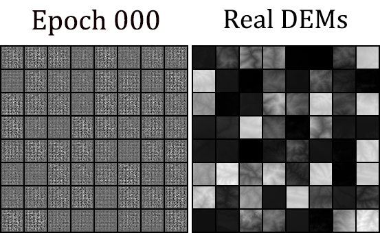

# CEDGAN for spatial interpolation
(Source code for paper) Spatial interpolation using conditional generative adversarial neural networks
https://doi.org/10.1080/13658816.2019.1599122

## Usage:
### train: an example of training based on the 10x10 uniform sampling
%run cdcgan.py --npre 0 --niter 200 --nk 1 --ncp 100  --lr 0.00005 --cuda --dataset DEM  --batchSize 64

### test: an example of calling the pre-trained model (200 epoches of training) with 10x10 sampled images
%run generate.py --batchSize 64 --netG outfile_100_samples --dataset DEM --ncp 100 --outf outfile_generate_loss/100samples

Only a small dataset is provided in this Git source, please contact patrick.zhu@pku.edu.cn for further collaboration

#### some optional parameters:
parser = argparse.ArgumentParser()

parser.add_argument('--batchSize', type=int, default=64, help='input batch size')

parser.add_argument('--imageSize', type=int, default=32, help='the height / width of the input image to network')

parser.add_argument('--nthread', type=int,default=1, help="number of workers/subprocess")

parser.add_argument('--ncp', type=int, default=100, help='size of the controlpoints')

parser.add_argument('--ngf', type=int, default=64)

parser.add_argument('--cuda', action='store_true', help='enables cuda')

parser.add_argument('--outf', default='outfile_generate_loss', help='folder to output images and model checkpoints')

parser.add_argument('--manualSeed', type=int, help='manual seed')

parser.add_argument('--dataset', default='DEM', help='which dataset to train on, DEM')

parser.add_argument('--netG', default='outfile', help="path to netG (to continue training)")

parser.add_argument('--logfile', default='outfile_generate_loss/100samples/errlog.txt', help="logfile to record error")

## Citation
Please cite our paper if CEDGAN helps you in your own work:

Zhu, D., Cheng, X., Zhang, F., Yao, X., Gao, Y., & Liu, Y. (2019). Spatial interpolation using conditional generative adversarial neural networks. International Journal of Geographical Information Science, 1-24.

@article{zhu2019spatial,

  title={Spatial interpolation using conditional generative adversarial neural networks},
  
  author={Zhu, Di and Cheng, Ximeng and Zhang, Fan and Yao, Xin and Gao, Yong and Liu, Yu},
  
  journal={International Journal of Geographical Information Science},
  
  pages={1--24},
  
  year={2019},
  
  publisher={Taylor \& Francis}

}

